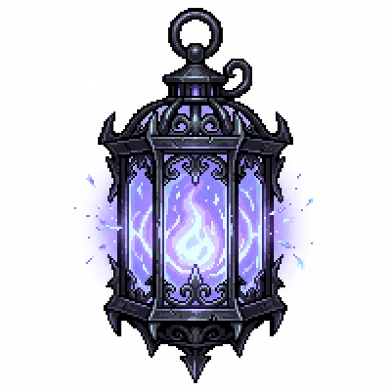
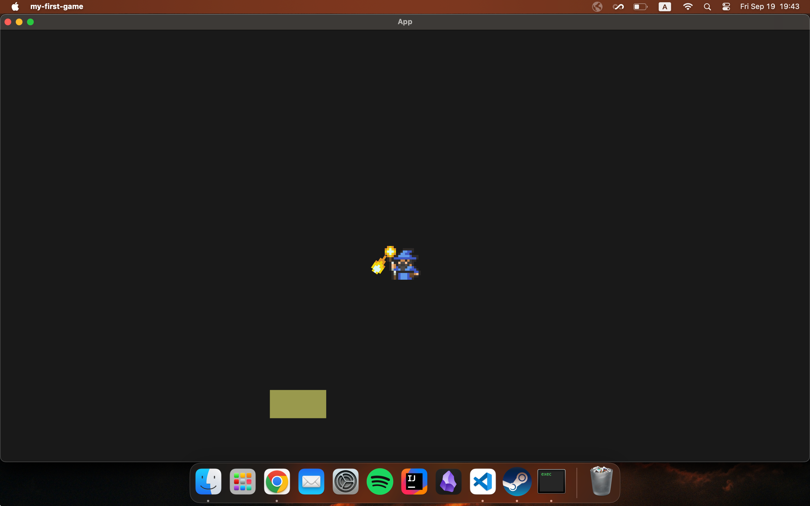

# YULAVEN

<p align="center">
  
</p>

> **"Where the soul-light flickers, the void hungers."**

**Yulaven** is a high-octane, arcane-survival action roguelike built with the **Bevy Engine**. Derived from the Old Turkic word *Yula* (soul/torch), Yulaven casts you as a mystic defender in a world consumed by an ancient, silent collapse.

## 🌌 The World of Yulaven

In the era of the *Yulaven* (the soul-haven), the boundaries between the physical realm and the primordial void have thinned. Legions of the *Harrowed*—creatures born from the static between stars—have begun their final harvest. As a Weaver of the Soul-Fire, you are the last light in a world going dark.

## ✨ Core Features

<p align="center">
  
</p>

*   **Dynamic Arcane Combat**: Master the *Arcane Orbs*, which intelligently seek out the nearest threats, and unleash the devastating *Nova Fireball*—a high-impact spell charged by the very energy of your fallen foes.
*   **Intelligent AI Ecology**: Experience the *Aggro-Field* system, where enemies react based on proximity and threat level, creating tactical "pockets" of combat rather than an overwhelming, mindless swarm.
*   **Intuitive Soul-HUD**: Monitor your vital *Kut* (sacred energy) and experience progression through a sleek, minimal interface designed for high-stakes survival.
*   **Fluid Movement**: Cast and combat without restriction. Your mobility is your greatest weapon in the dance against the void.

## 🛠️ Project Architecture

Yulaven follows a **domain-driven, plugin-based architecture** built with the **Bevy Engine**'s ECS. The codebase is organized into modular plugins for scalability and clear separation of concerns:

-   **`src/core/`**: Foundations of the game, including `GameState`, camera setup, and global resource initialization.
-   **`src/player/`**: Character-specific logic, movement controllers, and ability systems (e.g., active skills).
-   **`src/enemy/`**: AI behaviors, spawning algorithms, and mob-specific components.
-   **`src/combat/`**: The "meat" of the mechanics—handling projectiles, damage application, and effects like the *Nova* blast.
-   **`src/map/`**: Terrain generation, environmental boundaries, and world-building logic.
-   **`src/ui/`**: Reactive HUD elements, character selection menus, and map overlays.
-   **`src/constant.rs`**: Centralized tuning parameters (speed, tilt, spawn rates).

## 🚀 Getting Started

Ensure you have the latest Rust toolchain installed.

```bash
# Clone and enter the void
git clone <repo-url>
cd yulaven

# Ignite the soul-torch
cargo run --release
```

## 📱 Mobile Development

For Android development, several helper scripts are provided in the `scripts/` directory:

-   **`./scripts/build-android.sh`**: Compiles the native Rust code for Android targets.
-   **`./scripts/deploy-android.sh`**: Deploys the APK and tails logs (`adb logcat`).
-   **`./scripts/emulator.sh`**: Launches a pre-configured Android emulator.
-   **`./scripts/update-ndk-env.sh`**: Syncs VS Code settings with the local Android NDK path for `rust-analyzer`.


---

*Yulaven is an ongoing exploration of mythic survival mechanics. Developed with passion and the power of Bevy.*